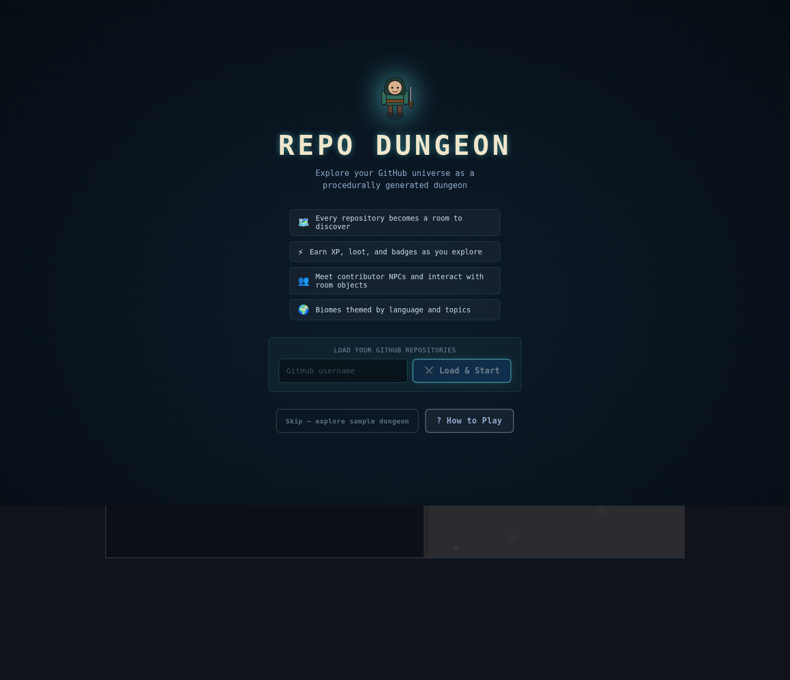
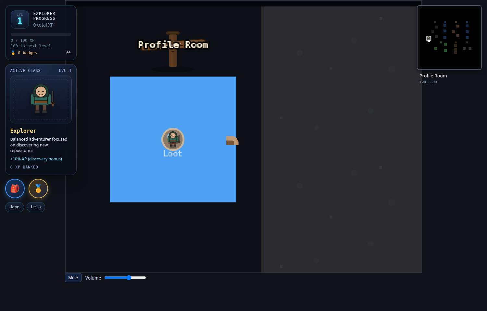
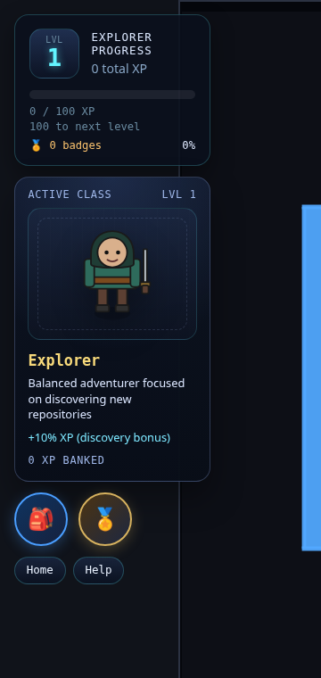

# Repo Dungeon

Turn a GitHub profile into a playable dungeon crawler.

Each repository becomes a room. You explore the dungeon, open room info panels, collect loot, unlock badges, and jump to GitHub when you find something interesting.



## Showcase






## What you can do in-game

- Generate a dungeon from GitHub repositories
- Move through rooms and corridors with keyboard controls on desktop or touch controls on mobile
- Open repo room details (README, files, contributors, stats)
- Use minimap/full map overlays while exploring
- Pick a class and gain XP, loot, and badges
- Track progression from a left-side HUD rail with a larger XP card, active class portrait, inventory button, badge panel, and help controls
- Track progress with visited room stamps and profile stats
- Repository data is cached locally so revisiting the same user loads instantly
- A small HUD indicator shows your remaining GitHub API budget for the current hour

## Quick start (play locally)

```bash
npm install
npm run dev
```

Open the local URL shown by Vite in your terminal. No environment configuration is required for the public-repos-only experience.

> **Note:** `.env.example` still contains some `VITE_GITHUB_*` variables and an `auth:proxy` script remains in `package.json`. These are vestigial from the original OAuth flow (since removed — the app now loads public repositories only) and are not consumed by the runtime. They can be safely ignored.

## GitHub setup

No authentication is required. The game loads public repositories by GitHub username.

Repository data and room details are cached in your browser's `localStorage` for up to 24 hours (room details for 7 days), keyed by username. Use the **🔄 Refresh** button on the welcome screen to re-fetch the latest data for a username at any time.

### Rate-limit handling & free revalidation

Public, unauthenticated GitHub REST has a budget of **60 requests / hour / IP**. Repo Dungeon stays well inside that budget through:

- **Persistent cache** — repo lists and room details are kept in `localStorage` for 24 h / 7 d respectively.
- **ETag-driven revalidation** — every persisted entry remembers the response `ETag`. After TTL expiry the app re-issues the request with `If-None-Match`; GitHub replies `304 Not Modified` for unchanged data, **which does not count against the rate limit**. Returning visits to the same dungeon cost ~0 quota.
- **Lazy README & contributors** — opening a room costs ~2 calls instead of 5; the README and contributors panels only fetch when their tab is opened, and the result is merged back into the persisted snapshot.
- **In-HUD budget counter** — a small `API N/60 · resets in Xm` indicator in the top-right of the game view shows your remaining quota, lights up amber below 15 / red below 5, and flashes a `✓ cached` pip whenever a request was satisfied by a free 304. If the budget is exhausted, the panel falls back to stale cached data instead of failing.

See [`docs/optimization-research.md`](docs/optimization-research.md) for the full breakdown of the techniques and how they are wired together.

## Controls

- **Move (desktop)**: `WASD` or arrow keys
- **Move (mobile/touch)**: on-screen D-pad shown during gameplay on touch devices
- **Interact (mobile/touch)**: on-screen `Interact` button
- **Full map**: `M`
- **Badges panel**: `B`
- **Help overlay**: `H`
- **Room info / close panels**: `Tab`, `I`, `Esc`
- **Inventory**: `I` (when progression UI is active)

## Manual testing flow (game-first)

1. Start the game and generate a dungeon.
2. Walk into several rooms and confirm room details load.
3. Open and close the full map (`M`) and confirm player marker updates.
4. Choose a class and confirm XP/level progress updates while exploring.
5. Open the badges panel (`B`) and confirm it shows unlocked and locked badge states.
6. Confirm loot and badge unlock overlays appear during exploration.
7. Click **Visit on GitHub** from room info and confirm it opens the repo.
8. Reload and verify visited-room progress persists.

### Mobile touch verification

1. Open the GitHub Pages build on a phone or in a mobile device emulator.
2. Start gameplay and confirm the on-screen D-pad and `Interact` button appear.
3. Hold each direction and confirm the player keeps moving while pressed.
4. Confirm diagonal movement works by pressing two directions together.
5. Stand near a contributor or room object and confirm the `Interact` button triggers the same interaction flow as keyboard `E` on desktop.

## Project docs

- Product requirements: `docs/PRD.md`
- Build and orchestration status: `docs/PROGRESS.md`
- Agent ownership map: `docs/agent-responsibility-matrix.md`

## Validation and release commands

```bash
npm run lint
npm run typecheck
npm run test -- --run
npm run build:web
npm run check:bundle-size
```

Electron packaging:

```bash
npm run build:electron
npm run package:electron
npm run package:electron:mac
npm run package:electron:win
npm run package:electron:linux
```

Release workflows:

- `.github/workflows/ci.yml`
- `.github/workflows/deploy-pages.yml`
- `.github/workflows/release-desktop.yml`

## Deploy and profiling notes

- Use `VITE_BASE_PATH` (for example `/repo-dungeon/`) for GitHub Pages web builds.
- Use `npm run build:web:profile` for sourcemap-enabled production profiling.
